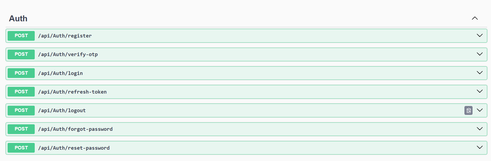
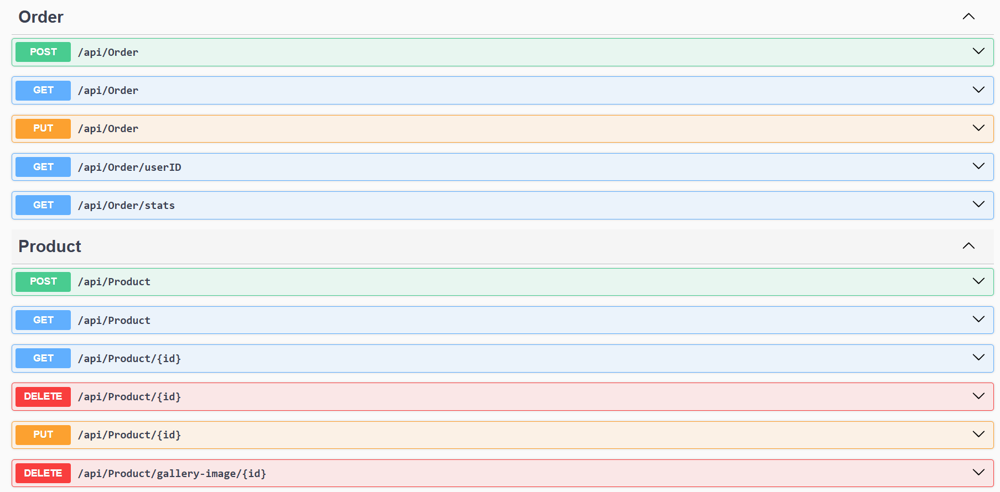
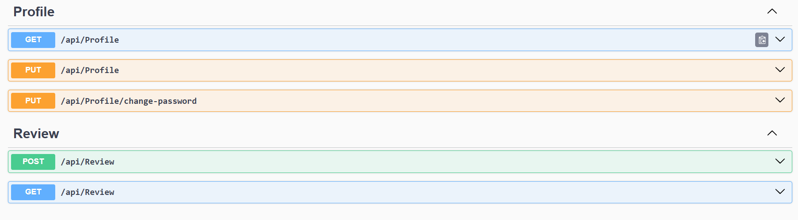

# eShop Full-Stack Backend API 🚀

A production-ready RESTful API for E-commerce platforms built with **ASP.NET Core 9**. This project implements advanced security patterns, complex business logic, and high-performance data handling.

## 🌟 Core Modules & Features

### 🔐 Advanced Authentication (Identity)
* **Complete Auth Cycle:** Register, Login, and **Logout**.
* **Account Security:** **OTP Verification**, **Forgot Password**, and **Reset Password** via Email Service.
* **Session Management:** Implemented **JWT Access Tokens** with **Refresh Token** logic for secure and seamless user sessions.

### 👤 Profile & Social
* **User Profile:** Managed user data updates and secure **Change Password** functionality.
* **Review System:** Star rating and commenting system with **Verified Purchase** logic.

### 🛒 E-Commerce Engine
* **Smart Cart:** Full Cart management (Add, Update, Delete items) synchronized with user accounts.
* **Order Orchestration:** * **Transaction-based** ordering system to ensure data consistency.
    * Administrative control for updating order statuses.
    * **Dashboard Stats:** Real-time analytics for Admin (Revenue, Orders, and Top Selling Products).

### 📦 Catalog Management
* **Product & Category CRUD:** Full administrative control over the catalog.
* **Data Optimization:** Implemented **Pagination, Filtering, Search, and Sorting** to handle large product lists.
* **Image Handling:** Integrated gallery image management and file cleanup logic.

## 🛠️ Technical Implementation
* **Framework:** .NET 9 (Web API)
* **Database:** SQL Server using **Entity Framework Core**.
* **Mapping:** **AutoMapper** for clean DTO/Entity transformations.
* **Reliability:** **Global Exception Handling Middleware** and **Fluent Validation**.
* **Documentation:** Fully documented via **Swagger UI**.

## 📂 Project Structure
Following Clean Architecture principles:
- `Controllers`: Handles API routing and requests.
- `Services`: Contains the core business rules and logic.
- `Models & Dtos`: Data structures and transfer objects.
- `Middlewares`: Custom logic for errors and security.
- `Helpers`: Utility classes for Email and JWT logic. Global exception handling and custom pipelines.

## 📸 API Documentation Preview (Swagger)

  
  

  
  

## 🚀 API Testing (Postman)
To test the API easily, you can use our Postman Collection:
1. Download the JSON file from the `Postman` folder in this repo.
2. Import it into Postman.
3. Set the `baseUrl` variable to your local running URL.
4. Run the **Login** request; the Auth Token will be automatically saved for all subsequent requests.

## 🔧 How to Run
1. Clone the repository.
2. Update the connection string in `appsettings.json`.
3. Run `Update-Database` in the Package Manager Console.
4. Press `F5` to run the project and explore the Swagger documentation.
